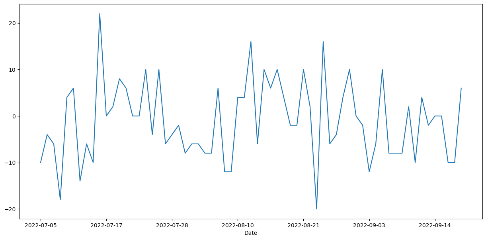

# Sales Data Analysis

This repository is for the Network Product Sales Prediction & Customers Data Analysis with Dashboard and Visualization project

##  Introduction

Welcome to the documentation for my project that involves importing a dataset into a database using SQLAlchemy and MySQL, Performing ETL on the dataset and Creating a Data Warehouse, Creating visualizations, Making a Prediction, and finally presenting the results in Power BI. This project aims to provide valuable insights into Network Products Sales data, enabling us to make informed decisions and gain a deeper understanding of Products Sales Information.

## Objectives

The primary objective of this project is to create a streamlined data pipeline for collecting, storing, analyzing, and visualizing Network Product sales data. By following this documentation, you will learn how to:

1. Create Database With MySQL: Create a database from the dataset and make Tables with Relationships between them.

2. Database Integration with SQLAlchemy: Learn how to set up and configure a SQL database using SQLAlchemy to Load the data efficiently.

3. Visualization & Prediction with Machine Learning: Explore various insights into the Network Products Sales and Creating Prediction with Machine Learning.

4. Power BI Integration: Finally, we will show you how to connect your database to Power BI to create interactive dashboards and visualizations to effectively communicate the insights derived from the data.

Below is a file structure of this project:

```
    .
    ├── Dataset    # Tables Extracted from the dataset
    |    ├── city.csv
    |    ├── Customers.csv
    |    ├── dataset.csv
    |    ├── products.csv
    |    ├── province.csv
    |    ├── sales.csv
    |    └─  time.csv
    ├── images
    |
    ├── NetSales.pbix    # Power BI Dashboard file
    |
    |
    ├── dataset.csv
    ├── initial.sql   # MySQL Queries
    |
    ├── NetSales Visualization and Connector.ipynb  # Notebook file for SQLAlchemy and Visualizations and Prediction
    |
    └── README.md # Explanation of project structure, tools used, and instructions for executing each part of the project.
    |
    └── requirements.txt
```

-----------------------------------------------------------------------------------
### Part 1: Create Database With MySQL


-----------------------------------------------------------------------------------
### Part 3: Visualization & Prediction with Machine Learning





- Future TO-DO:
- add Machine Learning Model and analysis for Prediction such as LSTM,...

-----------------------------------------------------------------------------------
### Part 4: Power BI Dashboard

#### Introduction
In this section we explore the process of integrating a database containing Sales data into Power BI, designing a Star Schema for data modeling, and creating analytical reports and visualizations to gain insights into the Network Products data.

#### Step 1: Database Integration
* Data Source
    * Ensure that you have the necessary credentials and permissions to access the database.
* Data Loading
    * Import data from the database into Power BI. You can use various methods, such as connecting directly to the database, importing CSV files, or using other data connectors.
#### Step 2: Data Modeling with Star Schema
- Understanding the Star Schema
    * Design a star schema data model. In a star schema, data is organized into fact tables and dimension tables.
- Fact Table
    * Create a fact table that contains transaction-level data. 
- Dimension Tables
    * Design dimension tables that provide context to the fact table. 
- Relationships
    * Establish relationships between the fact table and dimension tables. These relationships enable you to slice and dice data efficiently.
- Data Transformation
    * Apply necessary data transformations within Power BI, such as data cleansing, aggregation, and calculated columns, to prepare the data for analysis.


#### Step 3: Creating Analytical Reports
- Data Exploration
    * Start exploring the data using Power BI's data exploration capabilities. Use filters, slicers, and drill-through options to gain insights into the dataset.
- Visualization
    * Create a variety of visualizations to represent Sales data effectively. Common visualizations include line charts and more.

#### Step 4: Dashboard Creation
- Building Dashboards
    * Combine visualizations into interactive dashboards. Dashboards provide an overview of Network Products Sales data and allow users to interact with the data dynamically.

Conclusion
By integrating Our Sales data into Power BI, designing a Star Schema, and creating insightful reports and dashboards, you can harness the power of data analytics to make informed decisions in the Network Products Sales data.


